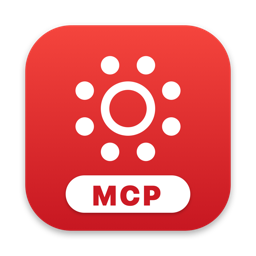

<h1 align="center">Canvas Cowork</h1>

Your University of Michigan Canvas, Piazza and lecture recordings in one Mac app, 
and in Claude and Codex through MCP.

<a href="https://github.com/jcasalmo/canvas-cowork/releases">What's new and older versions</a>

---

## What it does

- **Ask Claude or Codex about your classes.** What's due, your grades, syllabi and grading
  policies, Piazza posts, and what was said in lecture, answered from your own Canvas.
- **A Mac app for your classes.** Courses, assignments, announcements, files, Piazza and
  lecture recordings in one window.
- **Lecture transcripts, even before captions are out.** Lectures that don't have U-M
  captions yet can be transcribed on your Mac with Whisper (Apple silicon Macs). Only the
  audio is downloaded, and nothing is uploaded.
- **Drafts you review, never automatic submissions.** The AI can draft a submission or
  reply; it waits in the app's Review tab until you edit it and click Submit yourself.
  Graded quizzes can't be answered.

## Who it's for

U-M students. It signs in through U-M Weblogin and reads U-M Canvas
(`umich.instructure.com`), Piazza courses linked from Canvas, and CAEN Lecture Capture
(mostly College of Engineering courses). It won't work with other schools.

You need:

- a Mac on macOS 14 (Sonoma) or later, Apple silicon or Intel,
- the [Claude](https://claude.ai/download) desktop app (Code tab) or the Codex app, on a
  plan that includes them,
- Google Chrome is recommended for the sign-in window. Without it, setup downloads
  Chromium.

## Get started

1. **[Download Canvas Cowork](https://github.com/jcasalmo/canvas-cowork/releases/latest/download/Canvas-Cowork.dmg)**
   and drag it into Applications.
2. **Open Canvas Cowork.** It walks you through three quick steps: install the helpers,
   sign in to U-M, and pick Claude or Codex.
3. **Chat.** A new chat opens in your School folder with a first question typed in. Press
   Return.

**Next time:** click **Ask Claude** (or **Ask Codex**) in Canvas Cowork's sidebar. Chats
started that way know about your classes; your other chats aren't affected. For ideas,
open **What Can I Ask?** in the sidebar.

## Updates

The app updates itself. It checks once a day, downloads new versions in the
background, and installs them when you quit. **Canvas Cowork → Check for Updates…**
checks right away. Updates are signed; the app only installs ones that carry the
matching signature, and macOS checks Apple's notarization as well.

## Privacy

- Everything runs on your Mac. Your U-M sessions are stored in
  `~/.local/share/canvas-mcp/.env` and `~/.local/share/piazza-mcp/.env`, readable only by
  your account. Don't share those files.
- Sessions expire now and then. When the dot at the bottom left of the app's sidebar turns
  orange, click it to sign in again.
- When you use it from Claude or Codex, what the AI reads from Canvas goes to that AI
  service like anything else in the chat.

## Not affiliated

An independent student project. Not made by or affiliated with the University of
Michigan, Instructure (Canvas), Piazza, Anthropic or OpenAI. Follow each course's policy
on using AI.
